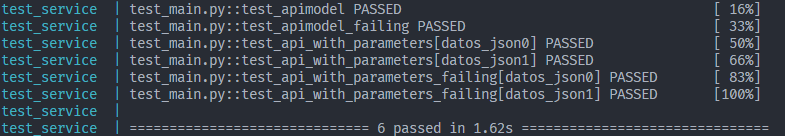
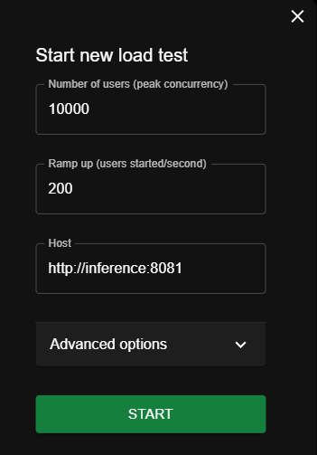
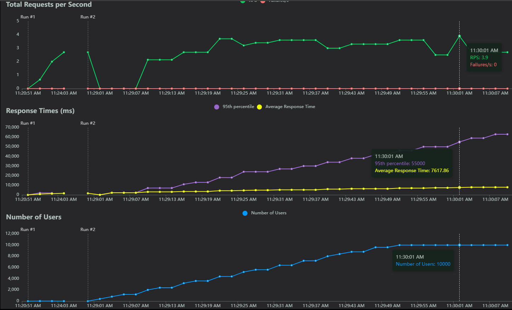
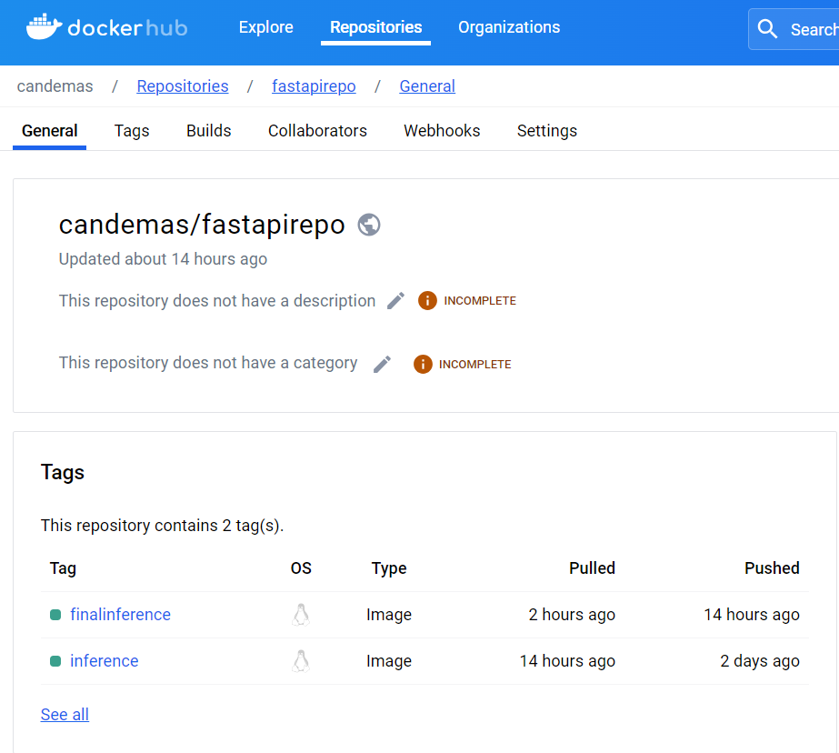

# MLOps - Assignment 4

## How to run this assignment

First of all you need to download this repo with the following command:

`git clone https://github.com/candemas97/MLOps.git`

> [!IMPORTANT]
>
> You **_must_** have running **project_2** to be able to run this assignment. If you do not have it running, please go to [Project 2](https://github.com/candemas97/MLOps/tree/main/project_2)

After that, follow the next steps:

1. Open this repo in **_Visual Studio Code (VSCode)_**.
2. Go to the docker-compose.yaml file
3. Open a new terminal in your current folder
4. Add the following line in your new terminal: `cd assignment_4`. This will allow you to be in the current assignment (**assignment 4**) because the terminal, by default, takes the main folder as the path.

> [!NOTE]
>
> If you only download the folder **assignment_4** you can skip this step (step 4)

5. Go to `docker`
6. Go to `fastapi_image`
7. Create and run the docker image:

```
docker-compose up
```

8. Wait till all the images load.
9. Go to your browser and (if you are running this in your local machine) got to `localhost:8081`

10. Go back to `docker`
11. Go to `locust`
12. Create and run the docker image:

```
docker-compose up
```

13. Wait till all the images load.
14. Go to your browser and (if you are running this in your local machine) got to `localhost:8086`

> [!IMPORTANT]
>
> Next steps corresponds to the Unit test. We recommend running this when you do not have

15. If you want to run the Unit test Go back to `docker`
16. Go to `tests`
17. Create and run the docker image:

```
docker-compose up --build
```

18. Watch results in the terminal, you should see something like this:



## Running the Assignment

1. Press `New`
2. Select the options you want to add

   

3. Wait till it start running, you should have the following stats:

   

## What was needed to do

- Create a Docker image that contains a FastAPI to allow inference on a previously trained model. This model should ideally be consumed from MLflow (you can use what was developed in Project 2) (inference image).
- Publish the inference image on DockerHub.
- Create a docker-compose.yaml that allows you to use the published image.
- Create a different docker-compose.yaml that allows you to perform load testing on your inference image (use Locust).
- Limit the resources of your inference container as much as possible so that it can handle 10,000 requests.

**Bonus**
Create unit tests that allow you to validate the correct operation of your inference image.

## What was done to solve it

1. To create an image was needed to use the `fastapi_topush` folder and run the image.
2. To publish the image first was needed to create and account, then add the credentials in terminal like this:

```
docker login
```

Later we ran the following lines of code to publish the image

```
docker tag inference:latest candemas/fastapirepo:finalinference
docker push candemas/fastapirepo:finalinference
```



3. We created a new `docker-compose.yaml` file where we use the new image. It can be found in `fastapi_image`

4. A new `docker-compose.yaml` was created to run locust. You can find it in `locust`

5. To add limits, we add th following line in the `fastapi_image docker-compose.yaml`

```
deploy:
    mode: replicated
    replicas: 1

    resources:
        limits:
        cpus: '2'
        memory: 500M
        reservations:
        cpus: '0.25'
        memory: 200M
```

**Bonus**

To do the unit tests, the file `test_main.py` was created, you can find it in `docker/tests/code/` and run it as mention before
