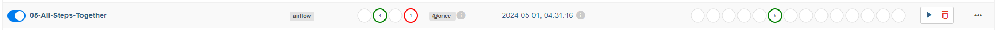
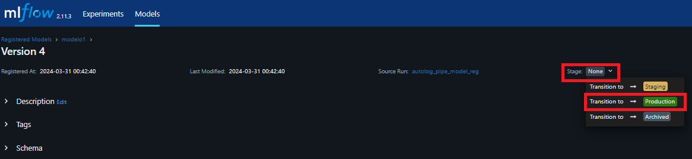

# MLOps - Project 3

## How to run this assignment

### Download the data to be extracted

Please go to `data` there you will find the step by step to doeenload the data and create the API t extract:

- Training data in batches
- Validation data (complete)
- Test data (complete)

### Use the restof the project

First of all you need to download this repo with the following command:

`git clone https://github.com/candemas97/MLOps.git`

After that, follow the next steps:

1. Open this repo in **_Visual Studio Code (VSCode)_**.
2. Go to the docker-compose.yaml file
3. Open a new terminal in your current folder
4. Add the following line in your new terminal: `cd project_3`. This will allow you to be in the current assignment (**project_3**) because the terminal, by default, takes the main folder as the path.

> [!NOTE]
>
> If you only download the folder **project_3** you can skip this step (step 4)

#### **Docker Part**

5. You should have three different folders needed: `dags`, `logs`, `plugins` if you do not have any of them you should run the following lines in your terminal:

> [!NOTE]
>
> - Only run the lines of the folders that you do not have.
> - You can run this on UNIX or WINDOWS

| Carpeta | Comando en terminal  |
| :-----: | :------------------: |
|  dags   |  `mkdir -p ./dags`   |
|  logs   |  `mkdir -p ./logs`   |
| plugins | `mkdir -p ./plugins` |

6. It is necessary to set the following variable for execution.

```
echo -e "AIRFLOW_UID=$(id -u)" > .env
```

7. Create and run the docker images, as we are using airflow we need to first run it:

```
docker-compose up airflow-init
docker-compose up
```

8. Wait till all the images load (_it will take a while!_)

#### **Kubernetes Part**

9. When it finishes open a new terminal.
10. Go to Kubernetes as follows:

```
cd project_3
cd kubernetes
```

11. Delete the `komposefiles` folder that is inside `kubernetes`

12. Download and give access to kompose

```
curl -L https://github.com/kubernetes/kompose/releases/download/v1.26.0/kompose-linux-amd64 -o kompose
chmod +x kompose
sudo mv ./kompose /usr/local/bin/kompose
```

13. Convert the `docker-compose.yaml` that is inside `kubernetes` to `kompose files` (Kubernetes files)

```
kompose convert -f docker-compose.yml -o komposefiles/ --volumes hostPath
```

14. Create the kubernetes images, there are two ways to do it:

_First way (running all folder)_

```
sudo microk8s kubectl apply -f komposefiles/
```

_Second way (running specific images)_

```
sudo microk8s kubectl apply -f komposefiles/fastapi-deployment.yaml,komposefiles/fastapi-service.yaml
sudo microk8s kubectl apply -f komposefiles/s3-deployment.yaml,komposefiles/s3-service.yaml
```

15. Take a look if your images are running

```
sudo microk8s kubectl get all --all-namespaces
```

16. Expose all the services that you have (you must expose each service in a new terminal):

```
sudo microk8s kubectl port-forward --address 0.0.0.0 service/s3 8083:8083
sudo microk8s kubectl port-forward --address 0.0.0.0 service/s3 8084:8084
sudo microk8s kubectl port-forward --address 0.0.0.0 service/fastapi 8085:8085
```

> [!NOTE]
>
> Due to S3 has two port you **must** expose both of them.

17. (Optional) To delete all your kubernetes run the following line:

```
sudo microk8s kubectl delete --all daemonsets,replicasets,services,deployments,pods,rc,ingress --namespace=default
```

## Setting up environment before running this project

Please follow the step-by-step given below in the **exact same order**.

### 1. MinIO

1. In your browser, go to:

```
localhost:8083
```

2. Add credentials

```
Username: admin
Password: supersecret
```

3. Go to Administrator >> Buckets >> Create Bucket

> I already have a created bucket, that's way you see a bucket called "project3bucket" **in this project** image is referential


4. In the "Bucket Name" type the name you want your bucket to have.
5. Press Create Bucket and now you have the bucket name that must be used in all your code

### 2. StreamLit

1. In your browser, go to:

```
localhost:8082
```

2. No extra steps needed in the set up.

> [!NOTE]
>
> - Running this app you will have access to the links of: MLFlow, FastAPI, Airflow and MinIO.
> - Next steps of the set up are necessaries but not mandatories if you run the StreamLit Instance

### 2. MLFlow

1. In your browser, go to:

```
localhost:8087
```

2. No extra steps needed in the set up.

### 3. FastAPI

1. In your browser, go to:

```
localhost:8085/docs
```

2. No extra steps needed in the set up.

### 4. Airflow

1. In your browser, go to:

```
localhost:8080
```

2. Add credentials

```
Username: airflow
Password: airflow
```

3. No extra steps needed in the set up.

### 5. (Optional) Jupyter

1. In your terminal search the following lines:

```
To access the server, open this file in a browser:
jupyter  |         file:///root/.local/share/jupyter/runtime/jpserver-7-open.html
jupyter  |     Or copy and paste one of these URLs:
jupyter  |         http://4f70ff082008:8088/lab?token=e81180fa07981f14235d64ac89875200b16f6453a5db3e91
jupyter  |      or http://127.0.0.1:8088/lab?token=e81180fa07981f14235d64ac89875200b16f6453a5db3e91
```

> [!NOTE]
>
> If you do not find it open a new terminal, write down `docker-compose stop jupyter`, wait till the cantainer stop and type `docker-compose up jupyter`

2. In your browser, go to:

```
localhost:8088
```

3. Then, whitin the browser, add the given token that is after `lab?token=` in my case it was `e81180fa07981f14235d64ac89875200b16f6453a5db3e91`
4. Search `jupyter_code` folder and click. There you will find all the code in a notebook.


## Running the project

### Training Model

0. Go to Airflow

There are two ways to train the model:

1. Using four dags

- 00-Only-Read-And-Save-Train-Data-Batches
- 01-Only-Read-And-Save-Validation-Data
- 02-Only-Read-And-Save-Test-Data
- 03-Preprocess-And-Save-Into-Clean-Data
- 04-Read-Clean-Data-And-Train-Model


> [!NOTE]
>
> Remember to wait until the DAG finishes to run the following

2. Using one DAG

- If you want to use the second option you just need to run the `05-All-Steps-Together`, it is not necessary to run any other DAG.



### Add model to production

0. Go to MLFlow
1. Go to Models and select the model you are using


2. Select the version you want to use.
3. Go to Stage >> Transition to `Production`



4. Your model is ready to be used

### Predicting using FastAPI

0. Go to FastAPI
1. Go to `Prediction Readmission`
2. Press `Try it out`
3. Add the needed data (You can add more than just one value t predict), for example:

```json
{
  "race": ["Caucasian"],
  "gender": ["Female"],
  "age": ["High level"],
  "admission_type_id": [2],
  "discharge_disposition_id": [1],
  "admission_source_id": [1],
  "time_in_hospital": [10.0],
  "num_lab_procedures": [36.0],
  "num_procedures": [3.0],
  "num_medications": [16.0],
  "number_outpatient": [0.0],
  "number_emergency": [0.0],
  "number_inpatient": [1.0],
  "number_diagnoses": [5.0],
  "metformin": ["No"],
  "repaglinide": ["No"],
  "nateglinide": ["No"],
  "chlorpropamide": ["No"],
  "glimepiride": ["No"],
  "acetohexamide": ["No"],
  "glipizide": ["No"],
  "glyburide": ["No"],
  "tolbutamide": ["No"],
  "pioglitazone": ["No"],
  "rosiglitazone": ["No"],
  "acarbose": ["No"],
  "miglitol": ["No"],
  "troglitazone": ["No"],
  "tolazamide": ["No"],
  "examide": ["No"],
  "citoglipton": ["No"],
  "insulin": ["Steady"],
  "glyburide_metformin": ["No"],
  "glipizide_metformin": ["No"],
  "glimepiride_pioglitazone": ["No"],
  "metformin_rosiglitazone": ["No"],
  "metformin_pioglitazone": ["No"],
  "change": ["No"],
  "diabetesMed": ["Yes"],
  "diag_1_group": ["Other"],
  "readmitted": ["NO"]
}
```

4. Press `Execute`
5. Your prediction will be shown in the screen

## Task Objective

It is needed to:

1. Create a data extractor that make train data to be pulled in batches
2. Read data from an external API using Airflow
3. Clean the data and save it in SQL
4. Training a model from Airflow to use MLFlow and to save the models and artifacts in MySQL and MinIO.
5. Predicting an outcome from FastAPI using the MLFlow productionized model.
6. Save the input and the prediction of the model in SQL
7. Create an interphase for the final user with streamlit

> [!NOTE]
>
> Services have to be running in Docker and in Kubernetes

Additional steps done (can be found in jupyter):

- EDA for selecting variables
- Test and Validation evaluation of the model

## System Architecture


The explanation of the system architecture is presented below:

1. Data was extracted through requests to the provided API using Airflow, and subsequently, this data was added to a MySQL database.
2. Subsequently, a query is made to the SQL table from the database, using Airflow to then send this data to MLFlow and train the model.
3. After the model is trained, the model information and artifacts are saved in MinIO and MySQL.
4. Finally, the best model generated with MLFlow is employed to make predictions with new data through FastAPI.

> [!NOTE]
>
> Streamlit is used as a graphical interface with the user to display the above in a friendly manner.
