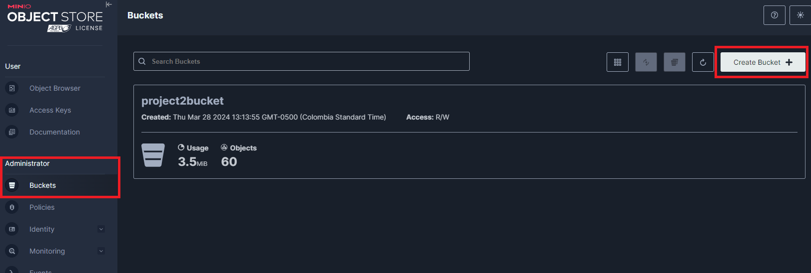
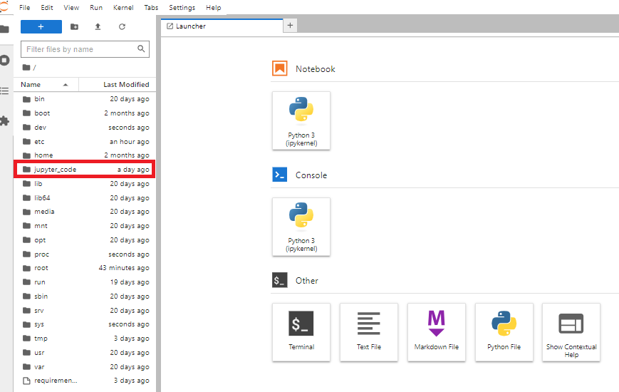
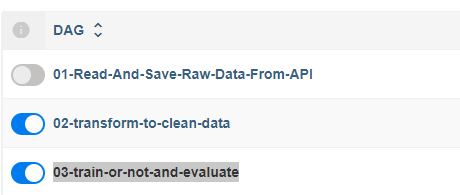
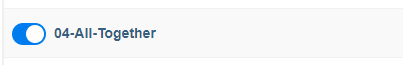
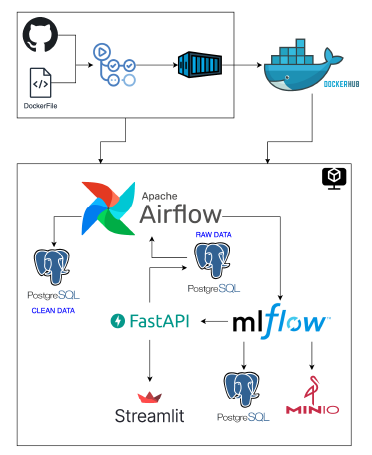

# MLOps - Project 4

## How to run this assignment

First of all you need to download this repo with the following command:

`git clone https://github.com/candemas97/MLOps.git`

After that, follow the next steps:

1. Open this repo in **_Visual Studio Code (VSCode)_**.
2. Go to the docker-compose.yaml file
3. Open a new terminal in your current folder
4. Add the following line in your new terminal: `cd project_4`. This will allow you to be in the current assignment (**project_4**) because the terminal, by default, takes the main folder as the path.

> [!NOTE]
>
> If you only download the folder **project_4** you can skip this step (step 4)

5. You should have three different folders needed: `dags`, `logs`, `plugins` if you do not have any of them you should run the following lines in your terminal:

> [!NOTE]
>
> - Only run the lines of the folders that you do not have.
> - You can run this on UNIX or WINDOWS

| Carpeta | Comando en terminal  |
| :-----: | :------------------: |
|  dags   |  `mkdir -p ./dags`   |
|  logs   |  `mkdir -p ./logs`   |
| plugins | `mkdir -p ./plugins` |

6. It is necessary to set the following variable for execution.

```
echo -e "AIRFLOW_UID=$(id -u)" > .env
```

7. Create and run the docker images, as we are using airflow we need to first run it:

```
docker-compose up airflow-init
docker-compose up
```

8. Wait till all the images load (_it will take a while!_)

## Setting up environment before running this project

Please follow the step-by-step given below in the **exact same order**.

### 1. MinIO

1. In your browser, go to:

```
localhost:8083
```

2. Add credentials

```
Username: admin
Password: supersecret
```

3. Go to Administrator >> Buckets >> Create Bucket

> I already have a created bucket, that's way you see a bucket called "project2bucket"



4. In the "Bucket Name" type the name you want your bucket to have (for this project use _**project4bucket**_)
5. Press Create Bucket and now you have the bucket name that must be used in all your code

### 2. StreamLit

1. In your browser, go to:

```
localhost:8082
```

2. No extra steps needed in the set up.

> [!NOTE]
>
> - Running this app you will have access to the links of: MLFlow, FastAPI, Airflow and MinIO.
> - Next steps of the set up are necessaries but not mandatories if you run the StreamLit Instance

### 2. MLFlow

1. In your browser, go to:

```
localhost:8087
```

2. No extra steps needed in the set up.

### 3. FastAPI

1. In your browser, go to:

```
localhost:8085/docs
```

2. No extra steps needed in the set up.

### 4. Airflow

1. In your browser, go to:

```
localhost:8080
```

2. Add credentials

```
Username: airflow
Password: airflow
```

3. No extra steps needed in the set up.

### 5. Jupyter

1. In your terminal search the following lines:

```
To access the server, open this file in a browser:
jupyter  |         file:///root/.local/share/jupyter/runtime/jpserver-7-open.html
jupyter  |     Or copy and paste one of these URLs:
jupyter  |         http://4f70ff082008:8088/lab?token=e81180fa07981f14235d64ac89875200b16f6453a5db3e91
jupyter  |      or http://127.0.0.1:8088/lab?token=e81180fa07981f14235d64ac89875200b16f6453a5db3e91
```

> [!NOTE]
>
> If you do not find it open a new terminal, write down `docker-compose stop jupyter`, wait till the cantainer stop and type `docker-compose up jupyter`

2. In your browser, go to:

```
localhost:8088
```

3. Then, whitin the browser, add the given token that is after `lab?token=` in my case it was `e81180fa07981f14235d64ac89875200b16f6453a5db3e91`
4. Search `jupyter_code` folder and click. There you will find all the code in a notebook.



## Running the project

### Training Model

0. Go to Airflow

There are two ways to train the model:

1. Using three dags

- 01-Read-And-Save-Raw-Data-From-API
- 02-transform-to-clean-data
- 03-train-or-not-and-evaluate



> [!NOTE]
>
> Remember to wait until the DAG finishes to run the following

2. Using one DAG

- If you want to use the second option you just need to run the `04-All-Together`, it is not necessary to run any other DAG.



### Predicting using FastAPI

0. Go to FastAPI
1. Go to `Prediction`
2. Press `Try it out`
3. Add the needed data (You can add more than just one value t predict), for example:

```json
{
    "brokered_by": [10481.0],
    "status": ["for_sale"],
    "bed": [3.0],
    "bath": [2.0],
    "acre_lot": [1.0],
    "street": [1612297.0],
    "city": ["Airville"],
    "state": ["Pennsylvania"],
    "zip_code": ["17302.0"],
    "house_size": ["1792.0"],
    "prev_sold_date": ["2013-07-12"]
}
```

4. Press `Execute`
5. Your prediction will be shown in the screen

## Task Objective

It is needed to:

0. Building and pushing all Docker Images to Docker Hub using Github Actions
1. Read data from an external API using Airflow
2. Training a model from Airflow to use MLFlow and to save the models and artifacts in MySQL and MinIO.
3. Decide if it is needed to train a new model according to some changes
4. Predicting an outcome from FastAPI using the MLFlow productionized model.
5. Creating a user interphase
6. Understand variables with SHAP

## System Architecture



The explanation of the system architecture is presented below:

1. Docker Images are created and published with Github Actions
1. Data was extracted through requests to the provided API using Airflow, and subsequently, this data was added to a MySQL database.
2. Subsequently, a query is made to the SQL table from the database, using Airflow to then send this data to MLFlow and train the model.
3. After the model is trained, the model information and artifacts are saved in MinIO and MySQL.
4. Finally, the best model generated with MLFlow is employed to make predictions with new data through FastAPI, this model is selected automatically.
5. If new data arrives, the system determine if it is needed to train again or not the model
6. After data is collected, a variable analysis is given by SHAP.

> [!NOTE]
>
> Streamlit is used as a graphical interface with the user to display the above in a friendly manner.
